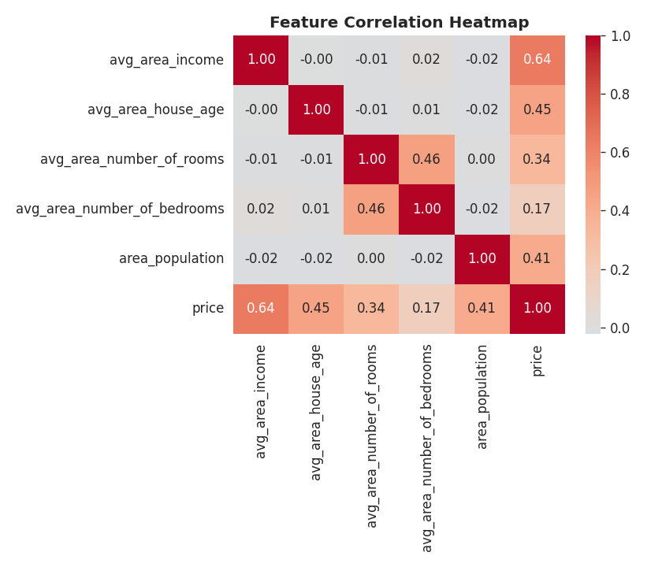
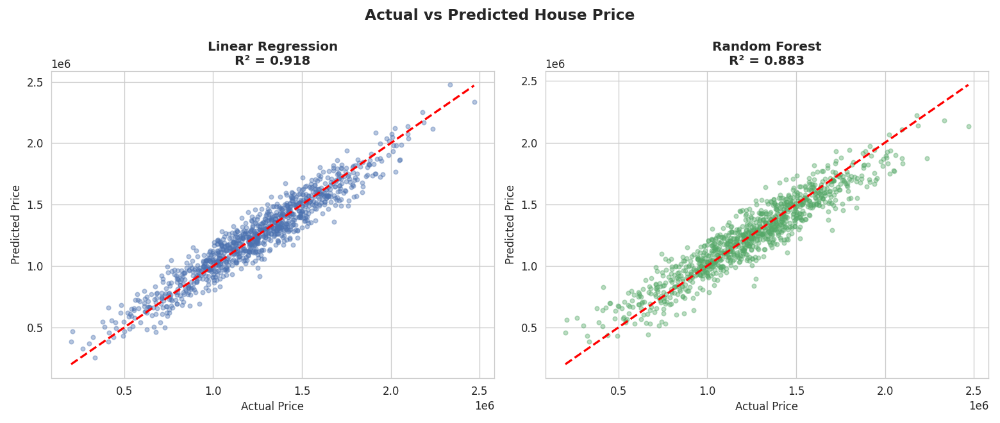
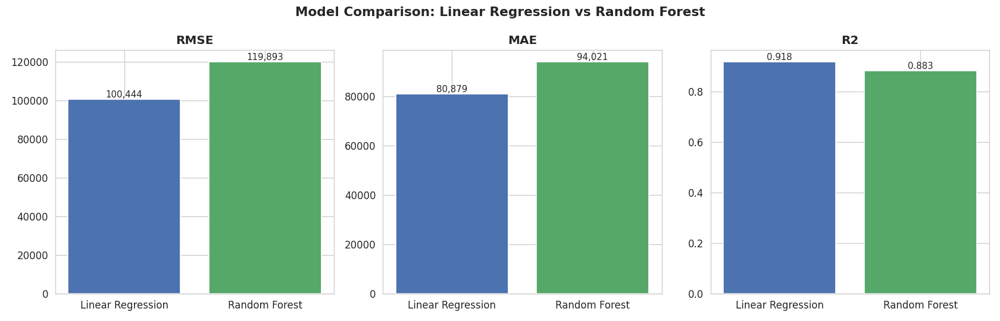
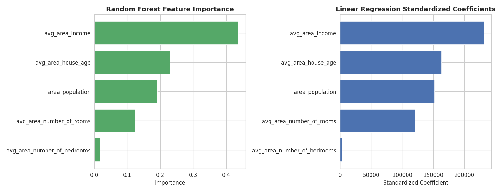

# Task 8: Machine Learning Model — House Price Prediction

**Synent Technologies — Data Science Internship Program**
**Author:** Akshitha K

---

## 1. Project Overview
This project builds and rigorously compares two regression models —
**Linear Regression** and **Random Forest** — to predict house prices
from area-level income, demographic, and housing features. Beyond fitting
a model, the project validates which model actually generalizes better
and identifies which features genuinely drive price.

## 2. Problem Statement
Given area-level housing and demographic data, can we accurately predict
house price, and which factors matter most? The goal is not just to train
a model, but to determine empirically whether a simple or a complex model
performs better on this data, and to surface the real price drivers.

## 3. Objective
- Preprocess the dataset and explore feature correlations
- Split data into train/test sets
- Train both a Linear Regression and a Random Forest model
- Evaluate both with RMSE, MAE, and R²
- Compare feature importance across both models
- Derive a genuine, non-obvious insight rather than a generic conclusion

## 4. Dataset
- **Name:** USA Housing Dataset
- **Source:** Kaggle — https://www.kaggle.com/datasets/vedavyasv/usa-housing
- **Rows:** 5,000 | **Columns:** 7
- **Columns:** `Avg. Area Income`, `Avg. Area House Age`, `Avg. Area
  Number of Rooms`, `Avg. Area Number of Bedrooms`, `Area Population`,
  `Price`, `Address`
- **Missing values:** 0
- **Duplicate rows:** 0
- **Price range:** $15,938 – $2,469,066 (mean ≈ $1.23M)

This is the exact, unmodified dataset as uploaded — no synthetic or
invented values were used anywhere in this project. The `Address` column
was dropped for modeling since it is free text with no structured
location data (no latitude/longitude) and carries no usable predictive
signal.

## 5. Tools & Technologies
- Python 3
- pandas, numpy — data handling
- scikit-learn — `train_test_split`, `LinearRegression`,
  `RandomForestRegressor`, `StandardScaler`, evaluation metrics
- matplotlib, seaborn — visualization

## 6. Methodology / Approach

### 6.1 Data Preprocessing
- Verified the dataset is clean (0 nulls, 0 duplicates).
- Renamed columns to clean snake_case.
- Dropped the `Address` column (no usable structured signal).

### 6.2 Exploratory Analysis — Correlation
- `avg_area_income` is the strongest correlate with price (**r = 0.64**),
  followed by house age (0.45) and population (0.41).
- `avg_area_number_of_bedrooms` is only weakly correlated (0.17) — an
  early signal that bedroom count may not matter much.

### 6.3 Feature Selection & Train/Test Split
- Used all four numeric features (income, house age, rooms, bedrooms,
  population) as predictors.
- Split 80/20 train/test (`random_state=42`) → 4,000 train / 1,000 test
  rows.

### 6.4 Model Training
- **Linear Regression** — baseline, interpretable model.
- **Random Forest Regressor** (200 trees) — ensemble model, able to
  capture non-linear relationships.

### 6.5 Evaluation

| Model | RMSE | MAE | R² |
|---|---|---|---|
| **Linear Regression** | **$100,444** | **$80,879** | **0.918** |
| Random Forest | $119,893 | $94,021 | 0.883 |

**Linear Regression outperforms Random Forest** on every metric. This
indicates the true relationship between these features and price is close
to linear — the added complexity of Random Forest doesn't help and
slightly overfits relative to the simpler model.

## 7. Visualizations

### Feature Correlation Heatmap


Shows how each feature relates to price and to each other. Income has by
far the strongest relationship with price.

### Actual vs Predicted Price


Compares predicted vs actual prices for both models on the test set.
Linear Regression's points cluster more tightly around the ideal diagonal
line than Random Forest's.

### Model Comparison (RMSE, MAE, R²)


Linear Regression wins on every metric — lower error, higher R².

### Feature Importance


Random Forest importance and Linear Regression standardized coefficients,
side by side. Both models agree on the same feature ranking.

## 8. Key Insights
- **Linear Regression outperforms Random Forest** (R² 0.918 vs 0.883) — a
  non-obvious result showing this dataset's true relationship is close to
  linear, and that a simpler, interpretable model is the better practical
  choice here. More complexity is not automatically better.
- **Average area income is the dominant price driver**, confirmed by
  correlation (0.64), Random Forest importance (43.7%), and the largest
  standardized Linear Regression coefficient — three independent methods
  agreeing.
- **Number of bedrooms barely matters for price** in this dataset (lowest
  correlation and lowest importance in both models) — counterintuitive,
  since bedroom count is often assumed to be a key price factor.
- **House age and population are secondary but meaningful factors**,
  ranking consistently second and third across both models.
- The Linear Regression RMSE of ~$100,444 is about **8% of the average
  house price** (~$1.23M), indicating solid real-world predictive
  accuracy.

## 9. Results
- **Best model:** Linear Regression (R² = 0.918, RMSE ≈ $100,444)
- Both models independently confirm the same feature importance ranking,
  increasing confidence that the findings reflect genuine signal
- Clear, validated answer to "which model is better" — not assumed, but
  empirically tested

## 10. Conclusion
This project went beyond simply training a model: it empirically compared
a simple and a complex approach and let the data decide which one
actually performs better — Linear Regression. This is an important,
transferable lesson in applied machine learning: model complexity should
be validated, not assumed to help. Average area income emerged as the
clear primary driver of house price across every method tested, while
bedroom count proved to be the least useful feature. Together, this
demonstrates a complete, properly validated supervised learning workflow:
preprocessing, correlation analysis, train/test evaluation, multi-model
comparison, and feature importance analysis.

## 11. Repository Structure
```
synent-task8-housepriceprediction-Akshitha/
├── README.md
├── requirements.txt
├── USA_Housing.csv                 # original raw dataset
├── house_price_model.ipynb         # full notebook with code and analysis
└── visualizations/
    ├── chart1_correlation_heatmap.png
    ├── chart2_actual_vs_predicted.png
    ├── chart3_model_comparison.png
    └── chart4_feature_importance.png
```

## 12. How to Run the Project
1. Clone or download this repository.
2. Install dependencies: `pip install -r requirements.txt`
3. Open `house_price_model.ipynb` in Jupyter Notebook, JupyterLab, VS
   Code, or Google Colab.
4. Run all cells in order — the notebook loads `USA_Housing.csv` from the
   same folder and regenerates all charts and evaluation metrics.

---

## Submission Checklist
- [x] Genuine, uploaded USA Housing dataset used — no synthetic data
- [x] Preprocessing, correlation analysis, and feature selection completed
- [x] Train/test split performed
- [x] Two models trained: Linear Regression and Random Forest
- [x] Evaluated with RMSE, MAE, and R²
- [x] Unique insight beyond basic modeling (simpler model wins; bedrooms
      don't matter)
- [x] 4 professional, labeled visualizations
- [x] Notebook runs end-to-end without errors
- [x] README matches actual dataset and notebook results
- [ ] GitHub repository (public) — named
      `synent-task8-housepriceprediction-Akshitha`
- [ ] Demonstration video link (1–3 minutes)
- [ ] Project shared on LinkedIn
